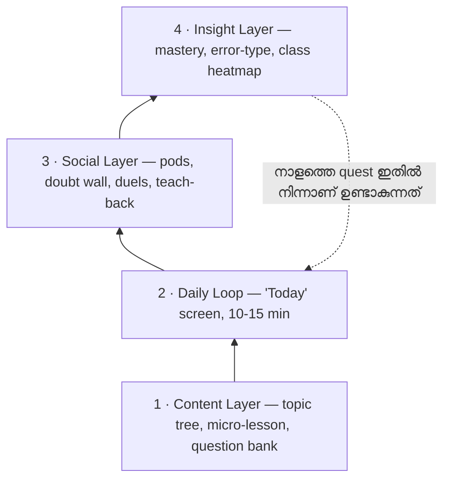
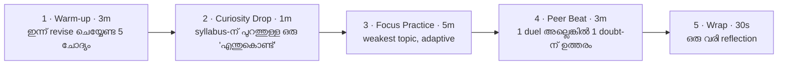

# QSPOT — Teen Learning Platform

**Product Plan v0.1** · 2026-09-18

---

## 0. ഒരു വരിയിൽ

QSPOT ഒരു "ഓൺലൈൻ ക്ലാസ്സ്" അല്ല. **പ്രായം 13–17 വരെയുള്ള കുട്ടികൾ ദിവസവും
10–15 മിനിറ്റ് സ്വയം മടങ്ങിവരുന്ന ഒരു practice + peer + mastery loop** ആണ്.

Classroom = content delivery + marks + teacher-paced.
QSPOT = practice loop + peer learning + mastery map + curiosity.

Content (subject content) ഇതിൽ **ഇന്ധനം** മാത്രമാണ്, ഉൽപ്പന്നം അല്ല. ഉൽപ്പന്നം
**loop** ആണ് — കുട്ടി നാളെ വീണ്ടും തുറക്കാൻ ഒരു കാരണം ഉണ്ടാവണം.

---

## 1. Positioning — എന്തുകൊണ്ട് ഇത് വ്യത്യസ്തം

Traditional classroom-ന്റെ ഘടന: ഒരാൾ പഠിപ്പിക്കുന്നു → എല്ലാവരും ഒരേ
വേഗത്തിൽ → ഒരു പരീക്ഷയിൽ അളക്കുന്നു → മാർക്ക് മാത്രം feedback.

അതിന്റെ മൂന്ന് പൊട്ടൽ:
1. **വേഗം** — ഒരാൾക്ക് 2 മിനിറ്റ്, മറ്റൊരാൾക്ക് 20 മിനിറ്റ്. ക്ലാസ്സിന് ഒരു വേഗം മാത്രം.
2. **അളവ്** — മാർക്ക് എന്നത് "എത്ര അറിയാം" അല്ല, "ഏത് ദിവസം എത്ര ഓർത്തിരുന്നു" എന്നതാണ്.
3. **ബന്ധം** — കുട്ടികൾ പരസ്പരം പഠിപ്പിക്കുമ്പോഴാണ് (teach-back) ഏറ്റവും ആഴത്തിൽ പഠിക്കുന്നത്. അത് ഇന്ന് ഒരിടത്തും record ചെയ്യപ്പെടുന്നില്ല.

QSPOT ന്റെ മൂന്ന് വാഗ്ദാനം:
- **കുട്ടിക്ക്:** ഇന്ന് എന്ത് ചെയ്യണം എന്നത് ഒരു screen-ൽ, 10 മിനിറ്റിൽ. ഉറപ്പുള്ള progress.
- **കൂട്ടുകാർക്കിടയിൽ:** സഹായിക്കുന്നതും ഒരു നേട്ടമാണ് (scored virtue).
- **രക്ഷിതാവിന്/അധ്യാപകന്:** മാർക്ക് അല്ല — **ഏത് topic-ൽ, എന്ത് തരം തെറ്റ്** എന്നതിന്റെ വ്യക്തമായ ചിത്രം.

---

## 2. ഉപയോക്താക്കൾ

| User | എന്താണ് വേണ്ടത് | അവർ എത്ര പ്രധാനം |
|---|---|---|
| **Student (13–17)** | ബോറടിക്കാത്ത, ചെറിയ, ഉടനെ ഫലം കാണുന്ന practice + കൂട്ടുകാർ | Primary — ഇവർ തുറക്കുന്നില്ലെങ്കിൽ ബാക്കിയെല്ലാം അർത്ഥശൂന്യം |
| **Teacher** | എന്റെ ക്ലാസ്സിൽ ആർക്ക് എവിടെ പ്രശ്നം — ഒരു glance-ൽ | Distribution + retention |
| **Parent** | "ഇത് നന്നായി ഉപയോഗിക്കുന്നുണ്ടോ, മെച്ചപ്പെടുന്നുണ്ടോ" | Trust, payment (പിന്നീട്) |
| **School/Admin** | ക്ലാസ്സുകൾ, അധ്യാപകർ, റിപ്പോർട്ട് | Scale |

പ്രധാന തീരുമാനം: **student-first UI**, teacher/parent എന്നത് അതിന്റെ മുകളിലെ
ഒരു പാളി മാത്രം. Teacher dashboard മുഖ്യമാക്കിയാൽ product ഒരു "homework app"
ആയി മാറും — അപ്പോൾ കുട്ടി അത് ഒഴിവാക്കും.

---

## 3. Design backbone — എന്തുകൊണ്ട് ഒരു കൗമാരക്കാരൻ മടങ്ങിവരും

Self-Determination Theory-യുടെ മൂന്ന് ആവശ്യങ്ങൾ ഇതിൽ നേരിട്ട് map ചെയ്യുന്നു.
ഇതാണ് feature തിരഞ്ഞെടുപ്പിന്റെ ഫിൽട്ടർ:

| ആവശ്യം | QSPOT-ൽ എങ്ങനെ |
|---|---|
| **Autonomy** (എന്റെ തീരുമാനം) | subject തിരഞ്ഞെടുപ്പ്, pod, avatar, "skip today" എന്നതും ഒരു ഓപ്ഷൻ |
| **Competence** (ഞാൻ മെച്ചപ്പെടുന്നു) | topic mastery bar, level up, "നിന്റെ weakest 3 topic" |
| **Relatedness** (ഞാൻ ഒരു കൂട്ടത്തിന്റെ ഭാഗം) | pod, duel, doubt wall, "നിങ്ങളുടെ ക്ലാസ്സിൽ 3 doubts കിടക്കുന്നു" |

ഒരു feature ഈ മൂന്നിൽ ഒന്നിനെയും തൊടുന്നില്ലെങ്കിൽ — MVP-യിൽ അത് വേണ്ട.

---

## 4. നാല് പാളികൾ (Architecture)



Loop-ന്റെ രഹസ്യം: **Insight Layer ആണ് നാളത്തെ Daily Loop-നെ നിർമ്മിക്കുന്നത്.**
അതുകൊണ്ടാണ് ഇത് ഒരു കോഴ്സ് അല്ല, ഒരു engine ആകുന്നത്.
(ഇല്ലെങ്കിൽ "ഇന്ന് എന്ത് ചെയ്യണം" എന്നതിന് ഉത്തരം എപ്പോഴും "അടുത്ത chapter"
ആയിരിക്കും — അതാണ് classroom.)

---

## 5. Daily Loop — ഉൽപ്പന്നത്തിന്റെ ഹൃദയം

ഒരു screen. **10–15 മിനിറ്റ്.** അഞ്ച് ഘട്ടം. ഇതാണ് "Today".



**1. Warm-up (3 min)** — Spaced repetition scheduler ഇന്ന് "മറക്കാൻ പോകുന്ന"
എന്ന് പറയുന്ന 5 ചോദ്യങ്ങൾ (വിവിധ subject-കളിൽ നിന്ന്). ഉദ്ദേശ്യം:
പഴയ topic ജീവനോടെ നിർത്തുക + ഉടനെ ഒരു "ഞാൻ അറിയുന്നുണ്ട്" എന്ന നേട്ടം നൽകുക.

**2. Curiosity Drop (1 min)** — ഇതാണ് delight hook. Syllabus-ൽ ഇല്ലാത്ത ഒരു
ചോദ്യം, poll രീതിയിൽ, ഉത്തരം കഴിഞ്ഞാൽ **കൂട്ടുകാർ എന്ത് ഉത്തരം പറഞ്ഞു** എന്ന
distribution കാണാം. ഉദാ:
> "ഒരു ദിവസം 24 മണിക്കൂറല്ലേ — ഒരു വർഷം കൃത്യം 365 ദിവസവുമല്ല. ബാക്കി എവിടെ പോകുന്നു?"

ഇത് വിജയത്തിന്റെ അളവ്: **ഇത് കാണാൻ വേണ്ടി മാത്രം ദിവസവും തുറക്കുന്ന**
കുട്ടികളുടെ എണ്ണം.

**3. Focus Practice (5 min)** — Insight Layer തിരഞ്ഞെടുത്ത weakest topic-ൽ നിന്ന്
6–8 ചോദ്യം. 3 തുടർച്ചയായി ശരി = topic level up. ഓരോ ചോദ്യത്തിനും മുമ്പ്
**confidence tap**: "ഉറപ്പാണോ? / സംശയമുണ്ട് / ഊഹം". (ഇത് എന്തിനെന്നത് §8-ൽ.)

**4. Peer Beat (3 min)** — രണ്ടിൽ ഒന്ന്, കുട്ടി തിരഞ്ഞെടുക്കുന്നു:
- ഒരു classmate-നോട് **5-ചോദ്യ duel** (async ആകാം — rival offline ആയാലും നടക്കും), അല്ലെങ്കിൽ
- Doubt Wall-ൽ കിടക്കുന്ന ഒരു ചോദ്യത്തിന് **ഉത്തരം എഴുതുക**.

**5. Wrap (30 sec)** — ഒരു വരി reflection + ഇന്നത്തെ XP/streak + നാളത്തെ teaser.

**Streak design (പ്രധാനം):** ആഴ്ചയിൽ ഒരു **Grace Day** സ്വയം ലഭിക്കും, coins കൊണ്ട്
**Freeze** വാങ്ങാം. കാരണം: streak ഒരു *ശീലം കെട്ടിപ്പടുക്കാനുള്ള tool* ആണ്, കുറ്റബോധം
ഉണ്ടാക്കാനുള്ള ആയുധം അല്ല. Streak പോയി ഉപേക്ഷിക്കുന്ന കുട്ടികളുടെ എണ്ണം ഞങ്ങൾ
guardrail metric ആയി നിരീക്ഷിക്കുന്നു.

---

## 6. Gamification — ലളിതവും, നിർമ്മിക്കാൻ എളുപ്പവും, ദോഷകരമല്ലാത്തതും

MVP-യിൽ ആവശ്യമുള്ളത് **ആറ്** കാര്യങ്ങൾ മാത്രം. ബാക്കിയെല്ലാം പിന്നീട്.

| Mechanic | എന്താണ് | എന്തുകൊണ്ട് ഇത് |
|---|---|---|
| **XP** | ചോദ്യം, ഉത്തരം, daily completion, peer help | അടിസ്ഥാന progress currency |
| **Subject-wise Level** | Math Lvl 7, Bio Lvl 3 — ഒരു global level അല്ല | ശരാശരി കുട്ടിക്കും "ഞാൻ ഇതിൽ നല്ലതാണ്" എന്നത് ലഭിക്കണം |
| **Coins** | avatar, streak freeze, hint unlock | കൂടുതൽ ചെലവഴിക്കുന്നത് — പഠനം |
| **Streak** | ദിവസം തുടർച്ച (+ Grace Day) | ശീലം |
| **Badges** | skill/behaviour അടിസ്ഥാനത്തിൽ: Explainer, Comeback (തോറ്റതിനു ശേഷം മെച്ചപ്പെട്ടത്), Deep Diver | grind അല്ല, നേട്ടം |
| **Pod League** | 5–6 പേരുടെ ടീം, ആഴ്ചയിൽ മറ്റ് pod-കളുമായി | ടീം ആണെങ്കിൽ ഒറ്റയാൾ വീഴുന്നത് അപമാനമല്ല |

**ഒഴിവാക്കേണ്ടത് (ഇതും ഒരു തീരുമാനമാണ്):**
- Global leaderboard — 99% കുട്ടികൾ എപ്പോഴും താഴെയായിരിക്കും.
- Public failure — ആരുടെയും തെറ്റ് പരസ്യമാക്കരുത്.
- Pay-to-win, loot box, energy timer.
- Streak-ന്റെ ഭയപ്പെടുത്തുന്ന നഷ്ടം.

---

## 7. Peer Communication & Peer Learning — ഇതാണ് ഏറ്റവും വലിയ Differentiator

### തത്വം
കൗമാരക്കാർക്ക് *relevance* വേണ്ടത് **ഒരു വലിയ feed അല്ല, ഒരു ചെറിയ സുരക്ഷിത
കൂട്ടം** ആണ്. അതുകൊണ്ട് social graph ഇങ്ങനെ:
**Pod (5–6) → Class (30) → School. അത്രമാത്രം. Public feed ഇല്ല. Followers ഇല്ല.
അപരിചിതരോട് DM ഇല്ല.**

### അഞ്ച് mechanics

**1. Doubt Wall (class-scoped)** — ഏറ്റവും ലളിതം, ഏറ്റവും ഫലപ്രദം.
ഒരു കുട്ടി doubt ഇടുന്നു → classmate 1–3 വാക്യത്തിൽ വിശദീകരിക്കുന്നു →
ചോദിച്ച കുട്ടി best answer തിരഞ്ഞെടുക്കുന്നു → ഉത്തരം നൽകിയവന് **Mentor XP**.
"നിങ്ങളുടെ ക്ലാസ്സിൽ ഇപ്പോൾ 3 doubts കിടക്കുന്നു" എന്ന ഒരു badge മതി —
ഇത് social obligation + ഉടനെ കിട്ടുന്ന അംഗീകാരം.

**2. Teach-back (Explain-to-earn)** — സിസ്റ്റം ഒരു prompt നൽകും:
> "Photosynthesis നിന്റെ കൂട്ടുകാരന് 60 സെക്കൻഡിൽ വിശദീകരിക്കുക."

Text അല്ലെങ്കിൽ voice. കൂട്ടുകാർ rating നൽകും → XP + badge. **ഒരാൾ പഠിപ്പിക്കുമ്പോൾ
അയാൾ ഇരട്ടി പഠിക്കുന്നു** — ഇത് classroom-ൽ ഇല്ലാത്ത ഒരേയൊരു ഏറ്റവും ശക്തമായ
mechanic ആണ്, അതുകൊണ്ട് ഇത് MVP-യിൽ തന്നെ വേണം.

**3. Study Pods** — 5–6 പേരുടെ ചെറിയ ടീം. ആഴ്ചത്തെ പൊതു ലക്ഷ്യം
(ഉദാ: 100 ചോദ്യം + 20 doubt-ന് ഉത്തരം). Pod XP. Pod-ന് ഒരു ചെറിയ text chat
(class-scoped, moderated).

**4. Quiz Duel** — 5 ചോദ്യം, 1v1. Async ആകാം (rival offline ആയാലും result).
Rematch button. ഇത് ഏറ്റവും കുറഞ്ഞ effort-ൽ ഏറ്റവും കൂടുതൽ social pull നൽകുന്നു.

**5. Peer Review** — open-ended ഉത്തരങ്ങൾ 2 കൂട്ടുകാർ ഒരു ചെറിയ rubric കൊണ്ട്
rate ചെയ്യുന്നു → "Reviewer" XP. ഇത് higher-order thinking നൽകുന്നു.

### Helpfulness ഒരു score ആണ്
ഏറ്റവും പ്രധാനമായ ഡിസൈൻ തീരുമാനം: ആഴ്ചയിലെ "Top Scorer"-ന് ഒപ്പം തന്നെ
**"Most Helpful"** എന്ന ഒരു തലക്കെട്ടും ഉണ്ട്. അതായത് ഒരു കുട്ടിക്ക്
ഉയർന്ന മാർക്ക് കിട്ടിയില്ലെങ്കിലും ക്ലാസ്സിൽ ഉയർന്ന status നേടാൻ ഒരു വഴിയുണ്ട്.

### സുരക്ഷയുടെ വേലി (safety rails)
- DM, photo/video sharing ഇല്ല. Text മാത്രം.
- Class scope മാത്രം; പുറത്തുനിന്ന് ആരും കാണില്ല.
- Profanity + bullying filter + report/block + teacher moderation queue.
- Rate limits (spam തടയാൻ), "kindness" prompt ഉത്തരം പോസ്റ്റ് ചെയ്യുമ്പോൾ.
- Anonymous ആയി ഒരു doubt ചോദിക്കാം (പക്ഷേ ഉത്തരം നൽകുന്നവർ അറിയപ്പെടും).

---

## 8. Subject-wise Performance — മാർക്കിന് അപ്പുറം

Traditional report card പറയുന്നത്: "Math 68/100". അതിൽ ഒരു വിദ്യാർത്ഥിക്കും
അധ്യാപകനും ഉപയോഗപ്രദമായ ഒരു വാക്യവും ഇല്ല.

QSPOT നാല് signal record ചെയ്യുന്നു:

**1. Topic-level Mastery** — ഓരോ topic-നും ഒരു score (0–100), അത്
recency + difficulty + correctness അനുസരിച്ച് **ക്ഷയിക്കുന്നു** (decay). അതായത്
"കഴിഞ്ഞ മാസം ഞാൻ ഇത് അറിഞ്ഞിരുന്നു" എന്നത് "എനിക്ക് ഇത് അറിയാം" അല്ല.
പഴയ topic-ന് score കുറയുമ്പോൾ അത് automatically നാളത്തെ Warm-up-ൽ വരും.

**2. Error Type** — ഓരോ തെറ്റും ഒരു തരം ആണ്:
concept തെറ്റ് / calculation തെറ്റ് / വേഗത കുറവ് / ഊഹം.
Marks കാണിക്കുന്നത് *എത്ര* തെറ്റ്. ഇത് കാണിക്കുന്നത് *എന്ത്* തെറ്റ്.

**3. Confidence vs Correctness** — ചോദ്യത്തിനു മുമ്പുള്ള ഒരു tap.
"ഉറപ്പാണ് + തെറ്റ്" = **overconfidence** → ഇതാണ് ഒരു വിദ്യാർത്ഥിയെക്കുറിച്ച്
ഏറ്റവും മൂല്യമുള്ള single insight. "സംശയം + ശരി" = ഭാഗ്യം, അതും കാണിക്കണം.

**4. Pace & Effort** — ചെലവഴിച്ച സമയം, ഉപേക്ഷിച്ച ചോദ്യങ്ങൾ, വീണ്ടും
ശ്രമിച്ചതിന്റെ എണ്ണം. (നിഷ്കർഷയുടെ അളവ്, കഴിവിന്റെ അല്ല.)

### നാല് dashboard-കൾ

**Student** — "Today" ≠ dashboard. ഇവിടെ ഒരു ചെറിയ **Mastery Map**: subject
തിരിച്ച് bars, "എന്റെ weakest 3 topic", കഴിഞ്ഞ ആഴ്ചയിലെ delta. കുട്ടി
സ്വന്തം data-ന്റെ ഉടമയാണ് — **ആദ്യം കാണുന്നത് കുട്ടിയാണ്, രക്ഷിതാവല്ല.**

**Teacher** — ഒരു **class heatmap**: topic × mastery. "ഈ ആഴ്ച ക്ലാസ്സിൽ ഏറ്റവും
പിന്നിൽ: Quadratic Equations (58%), 11 കുട്ടികൾക്ക് concept error." അധ്യാപകന്
ഇതൊരു അടുത്ത ക്ലാസ്സിന്റെ lesson plan ആണ്. (ഇത് ഒരു അധ്യാപകനെ
വിജയിപ്പിക്കുന്ന feature ആണ് — onboarding-ന്റെ താക്കോൽ.)

**Parent** — ആഴ്ചയിൽ ഒരു **Growth Card**, മാർക്ക് അല്ല:
- എത്ര ചോദ്യം practice ചെയ്തു
- ഏത് topic-ൽ എത്ര മെച്ചപ്പെട്ടു
- എത്ര കൂട്ടുകാർക്ക് സഹായിച്ചു

**School/Admin** — ക്ലാസ്സുകൾ തമ്മിലുള്ള comparison അല്ല; ഏത് അധ്യാപകന്/ക്ലാസ്സിന്
ഏത് topic-ൽ support വേണം.

---

## 9. Traditional Classroom-ന് അപ്പുറം — എട്ട് വ്യത്യാസങ്ങൾ

1. **Student-as-teacher** — സ്കോർ ചെയ്യപ്പെടുന്ന ഒരു പഠന മാർഗ്ഗം, ഒരു student-led activity ആയി.
2. **Curiosity-first** — ദിവസത്തിലെ ഒരു ചോദ്യം syllabus-ന്റെ പുറത്തുനിന്ന്.
3. **Philosophy: Mastery over marks** — "എത്ര കഴിഞ്ഞു" അല്ല, "എന്ത് കൈവന്നു".
4. **Peer network** — അധ്യാപകനിൽ നിന്ന് മാത്രമല്ല, സമപ്രായക്കാരിൽ നിന്നും പഠനം.
5. **Helpfulness is a status** — സഹായിക്കുന്നത് ഒരു നേട്ടം.
6. **Micro-sessions** — 10 മിനിറ്റ് ഇടവേളകളിൽ, സ്വന്തം വേഗത്തിൽ, mobile-first.
7. **Student owns the data** — analytics ആദ്യം കുട്ടിക്ക്, പിന്നെ മാത്രം മറ്റുള്ളവർക്ക്.
8. **Safe social graph** — class-scoped. പരസ്യമായ ഒരു പ്രൊഫൈൽ ഇല്ല, ഒരു ad ഇല്ല.

---

## 10. MVP — ലളിതമായി തുടങ്ങുന്നത് എങ്ങനെ

**അടിസ്ഥാന തത്വം:** ഒരു MVP-യിൽ **രണ്ട് subject** മതി (ഉദാ: Math, Science),
**ഒരു ക്ലാസ്സ് ലെവൽ** മതി, **ഒരു സ്കൂൾ** മതി. Content 100% ശരിയാക്കാൻ
നിൽക്കരുത് — loop ശരിയാണോ എന്നതാണ് ആദ്യം പരിശോധിക്കേണ്ടത്.

### Phase 1 — "ഒരു ക്ലാസ്സ് പൂർണ്ണമായി ഉപയോഗിക്കുന്നു" (4–6 ആഴ്ച)

| # | Feature | Priority | Effort |
|---|---|---|---|
| 1 | Auth (phone/email) + join code ഉപയോഗിച്ച് class-ൽ ചേരൽ | P0 | S |
| 2 | Topic tree + question bank (CSV import, 2 subject) | P0 | M |
| 3 | **Daily Quest flow** (5 ഘട്ടം, §5) | P0 | L |
| 4 | XP + streak (+ Grace Day) | P0 | S |
| 5 | **Doubt Wall** (post → answer → best answer → Mentor XP) | P0 | M |
| 6 | Topic mastery bar + "weakest 3" | P0 | M |
| 7 | Teacher view: class roster + "ആർ എവിടെ" | P0 | M |
| 8 | Confidence tap + error type (rule-based) | P1 | S |
| 9 | Simple class leaderboard (**opt-out ഉണ്ട്**) | P1 | S |

### Phase 2 — Social layer പൂർണ്ണമാക്കൽ
Pods + pod chat, Quiz Duel, badges, avatar + coin shop, **Teach-back**,
teacher heatmap, weekly Growth Card, notification/ഉപേക്ഷിച്ചവരെ തിരികെ
കൊണ്ടുവരാനുള്ള flow.

### Phase 3 — Intelligence
Adaptive difficulty engine (item difficulty + ability estimate), spaced
repetition tuning, AI hint, AI ഉപയോഗിച്ച് doubt summarise/moderation,
parent app, teacher content authoring, school-wide analytics.

---

## 11. Tech — ലളിതവും ചെലവ് കുറഞ്ഞതും

**തത്വം:** ഒരു developer + ഒരു designer ഇത് നിർമ്മിക്കാൻ പറ്റണം. Native app ഇല്ല —
**PWA** (mobile web, "Add to Home Screen").

| ഭാഗം | തിരഞ്ഞെടുപ്പ് | കാരണം |
|---|---|---|
| Frontend | Next.js (App Router) + TypeScript + Tailwind | ഒരു codebase, PWA, fast |
| Backend/DB | **Supabase** — Postgres + Auth + Realtime + RLS | ഒരു service; RLS ഉപയോഗിച്ച് class-scoped access = social layer-ന്റെ സുരക്ഷ DB-യിൽ തന്നെ |
| Realtime | Supabase Realtime | Duel, pod chat |
| Scoring | Postgres functions / edge functions (client-ൽ അല്ല) | കുട്ടികൾ score hack ചെയ്യുന്നത് തടയാൻ |
| Scheduled jobs | Supabase cron | രാത്രി quest generate + streak evaluate |
| Hosting | Vercel | ലളിതം |
| Content | CSV/JSON import → admin UI | Content ടീം പെട്ടെന്ന് കൂട്ടിച്ചേർക്കാൻ |

> RLS (Row Level Security) ഇവിടെ ഒരു "nice to have" അല്ല. "എന്റെ ക്ലാസ്സിലെ
> കുട്ടികൾ മാത്രം എന്റെ doubt കാണണം" എന്നത് database level-ൽ ഉറപ്പാക്കണം —
> UI-ൽ മാത്രം ഒളിപ്പിച്ചാൽ അത് ഒരു privacy incident ആണ്.

### Data model (ചുരുക്കം)

```
users, schools, classes, class_members(role)
subjects, topics(id, parent_id, subject_id, order)      -- tree
questions(topic_id, difficulty, type, options, answer, explanation)
attempts(user_id, question_id, correct, ms, confidence, error_type, ts)
mastery(user_id, topic_id, score, last_seen, next_review, streak)
daily_quests(user_id, date, steps_json, completed_at)
xp_events(user_id, source, amount, ref_id, ts)
badges, user_badges
pods, pod_members, pod_goals
posts(doubts), replies, best_reply_id, votes
teachbacks(topic_id, author_id, media_type, body, avg_rating)
duels(challenger_id, opponent_id, questions, result)
moderation_reports(target_type, target_id, reason, status)
```

---

## 12. സുരക്ഷ, Privacy, Moderation (കൗമാരക്കാർ!)

ഇത് "പിന്നീട് ചെയ്യാം" എന്ന ലിസ്റ്റില്ല. ഇത് ഒരു feature ആണ്.

- **India DPDP Act 2023** — 18 വയസ്സിന് താഴെയുള്ള എല്ലാവർക്കും verifiable
  parental consent വേണം. പ്രായോഗിക വഴി: **സ്കൂൾ മുഖേനയുള്ള consent**
  (school ഒരു partner/fiduciary ആയി) — ഇത് onboarding friction കുറയ്ക്കും.
  കേരളം/India പ്രധാന market ആണെങ്കിൽ ഇത് architecture-ൽ തന്നെ വേണം.
- **Data minimisation** — പേര്, ക്ലാസ്സ്, ഇമെയിൽ. ഫോട്ടോ, ഫോൺ നമ്പർ, GPS വേണ്ട.
- **No ads targeting minors. No data selling. No third-party trackers.**
- Moderation: profanity filter + AI pre-check + report/block + teacher/admin queue.
- **No infinite feed, no autoplay, no "engagement for engagement's sake".**
- Parent-ന് എപ്പോഴും "എന്റെ കുട്ടിയുടെ data കാണുക / ഡിലീറ്റ് ചെയ്യുക" എന്ന
  അവകാശം. ഒരു school contract-ൽ ഇത് spill out ചെയ്യരുത്.
- **Anti-cheat light** — duel-ൽ speed-based scoring + random question order.

---

## 13. Metrics — എന്താണ് "പ്രവർത്തിക്കുന്നു" എന്നത്

**Growth**
- **D1 / D7 / D30 retention** — ഇതാണ് ഒന്നാമത്തെ സംഖ്യ. 40%+ D7 = loop ശരിയാണ്.
- Daily Quest completion rate (target >55%)
- ഒരു active user-ന് ദിവസേനയുള്ള ചോദ്യങ്ങൾ
- **Peer answers per active student / week** (social layer-ന്റെ ഹൃദയമിടിപ്പ്)
- Teach-backs / week
- Student-ന് monthly mastery delta
- Teacher weekly active (content/heatmap കാണാൻ തിരികെ വന്നത്)

**Guardrail (ഇത് മോശമായാൽ feature പിൻവലിക്കുന്നു)**
- Streak പോയതിനു ശേഷം ഉപേക്ഷിച്ച കുട്ടികളുടെ %
- Moderation reports per 100 peer interactions
- Leaderboard opt-out %
- "Anxious/pressured" എന്ന student feedback (ചെറിയ survey)

---

## 14. Risks & mitigations

| Risk | Mitigation |
|---|---|
| **Cold start** — ക്ലാസ്സിൽ 5 പേരേ ഉള്ളൂ എങ്കിൽ social layer ചത്തു | Class-level rollout; 15+ ആകാത്ത ക്ലാസ്സിൽ social features off ചെയ്യുക |
| Content quality / answers തെറ്റ് | Expert review + "ഈ ഉത്തരം തെറ്റാണ്" report button + version history |
| Leaderboard anxiety | Team league + opt-out + never show the bottom half |
| അധ്യാപകൻ onboard ചെയ്യുന്നില്ല | Teacher dashboard അവരുടെ *സമയം ലാഭിക്കുന്നതാണെന്ന്* കാണിക്കുക (heatmap = lesson plan) |
| രക്ഷിതാക്കൾക്ക് മാർക്ക് വേണം | Growth Card-ൽ "mastery" എന്നത് പരീക്ഷാ-ഫലവുമായി correlate ചെയ്ത് കാണിക്കുക |
| Moderation ചെലവ് | AI pre-filter → മനുഷ്യൻ റിപ്പോർട്ട് ചെയ്തവ മാത്രം നോക്കുന്നു |
| Screen time criticism | ദിവസത്തെ limit ഉദ്ദേശപൂർവ്വം 15 മിനിറ്റിൽ താഴെ; "ഇത് Duolingo അല്ല" |

---

## 15. Rollout

1. **Week 0–1:** 1 സ്കൂൾ, 2 ക്ലാസ്സ്, 1 subject, 60 കുട്ടികൾ. Content 150 ചോദ്യം.
2. **Week 2–4:** Daily loop + Doubt Wall live. ഓരോ ആഴ്ചയും student 5 പേരെ interview ചെയ്യുന്നു.
3. **Week 5–6:** Mastery map + teacher heatmap. D7 retention പരിശോധിക്കുന്നു.
4. **Decision gate:** D7 < 25% ആണെങ്കിൽ **content കൂട്ടരുത്** — loop തിരുത്തുക.
5. **പിന്നീട്:** 3-ാം സ്കൂൾ, phase 2 social features.

---

## 16. തീരുമാനിക്കേണ്ട കാര്യങ്ങൾ (എനിക്ക് നിങ്ങളുടെ input വേണം)

1. **Curriculum** — Kerala SCERT / CBSE / ICSE? (topic tree ഇതിനെ ആശ്രയിച്ചിരിക്കും)
2. **ഭാഷ** — Malayalam first, അതോ English? (ഒന്ന് തിരഞ്ഞെടുത്താൽ content cost പകുതിയാകും)
3. **Grade band** — 8–10, അതോ 11–12? (11–12 = exam pressure, വ്യത്യസ്ത design)
4. **Distribution** — B2C (രക്ഷിതാവ് pay) അതോ B2B (സ്കൂൾ pay)? (social layer-ന്റെ size ഇത് നിർണ്ണയിക്കും)
5. **Content ആരുണ്ടാക്കും** — നമ്മൾ, അതോ അധ്യാപകർ author ചെയ്യുമോ?
6. **Team** — build ചെയ്യാൻ എത്ര പേർ, എത്ര ആഴ്ച?

---

## അനുബന്ധം — ഒരു കുട്ടിയുടെ ദിവസം (script)

> **18:40** — ശ്രേയ നട്ട്സ് കഴിച്ചു. ഫോണിൽ QSPOT തുറക്കുന്നു. "Today" screen.
> "5 ദിവസം streak. ഇന്ന് 3 doubts നിങ്ങളുടെ ക്ലാസ്സിൽ." **തുറക്കുന്നു.**
>
> **18:41** — Warm-up: 5 ചോദ്യം. 4 ശരി. "നിങ്ങൾ കഴിഞ്ഞ ആഴ്ച മറന്നുപോയ
> Acid-Base ഇന്ന് ഓർത്തു." — ഉടനെ ഒരു നേട്ടം.
>
> **18:43** — Curiosity Drop: "ആകാശം നീലയായിരിക്കുമ്പോൾ ചന്ദ്രനിൽ എന്തുകൊണ്ട്
> ആകാശം കറുപ്പാണ്?" 62% കുട്ടികൾ തെറ്റായ ഉത്തരം പറഞ്ഞു എന്നത് കാണുന്നു.
> ചിരി. ഒരു ചെറിയ വീഡിയോ. **(loop-ന്റെ വാടക ഇവിടെ അടയ്ക്കുന്നു.)**
>
> **18:46** — Focus Practice: weak topic "Linear Equations", 8 ചോദ്യം. ഒരു
> ചോദ്യത്തിന് മുമ്പ് "ഉറപ്പാണോ?" — "ഉറപ്പാണ്" എന്ന് പറഞ്ഞ് തെറ്റിച്ചു.
> (ആത്മവിശ്വാസത്തിന്റെ വിടവ് — teacher-ന് ഇത് കാണാൻ കഴിയും.)
>
> **18:52** — Peer Beat: ആരവ് 4–2 എന്ന് ശ്രേയയെ തോൽപ്പിച്ചു. Rematch ബട്ടൺ.
>
> **18:54** — Doubt Wall: ഒരു കൂട്ടുകാരി ചോദിച്ച "എന്തുകൊണ്ട് -3 × -3 = +9?"
> ശ്രേയ 2 വാക്യത്തിൽ വിശദീകരിക്കുന്നു → Mentor XP. **അവൾ ഇന്ന്
> ഒരു അധ്യാപികയായി.** ഇത് വിട്ടുകളയരുത്.
>
> **18:56** — Wrap. "നാളെ: Trigonometry — നിങ്ങൾക്ക് ഇത് പഠിക്കാൻ കഴിയും."
> Streak 6. **അടയ്ക്കുന്നു.** 16 മിനിറ്റ്.

ഈ script ശരിയായി അനുഭവപ്പെടുന്നുണ്ടോ എന്നതാണ് MVP-യുടെ യഥാർത്ഥ acceptance test.
